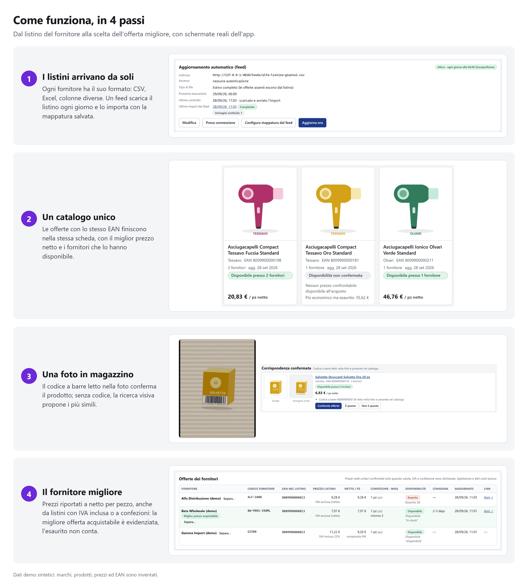
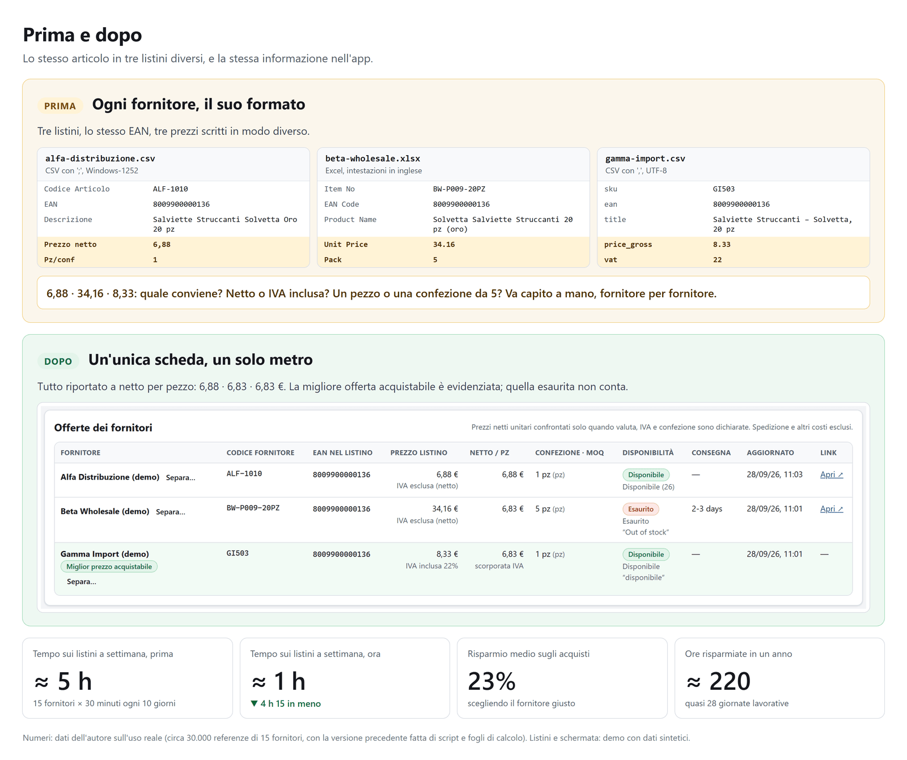
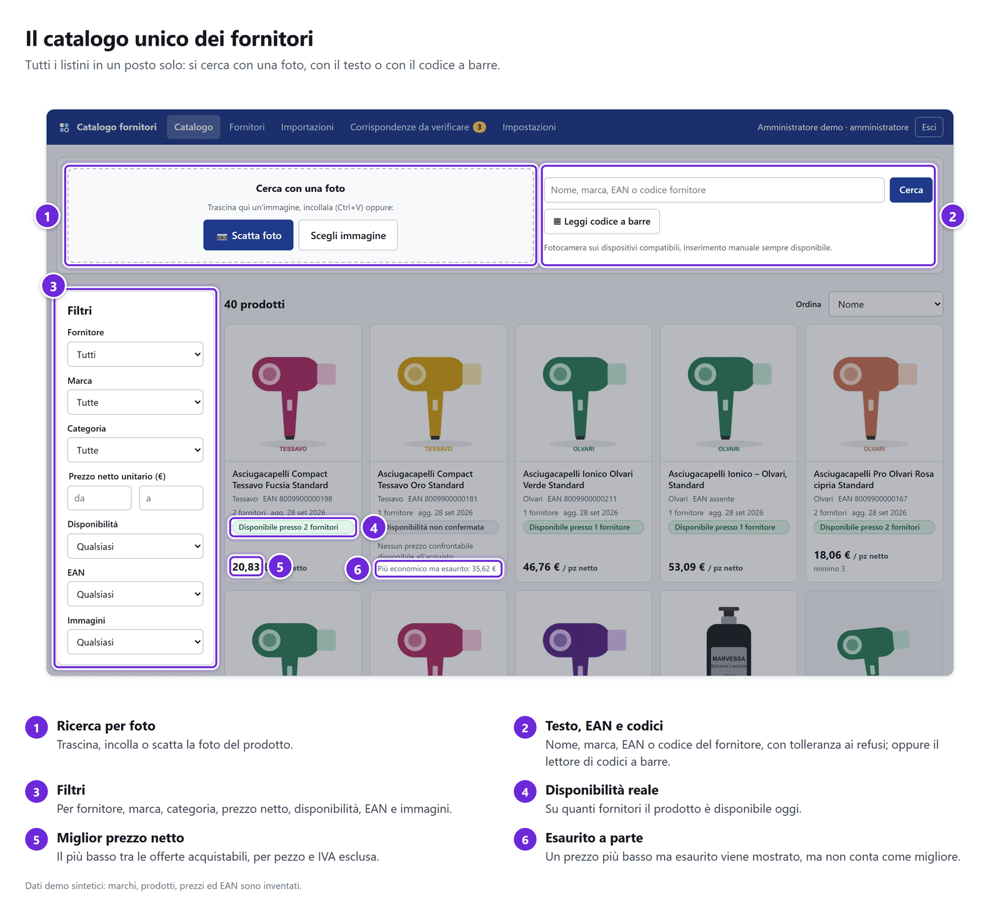
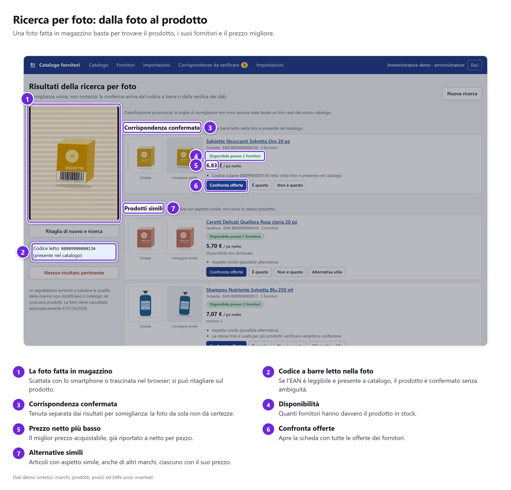
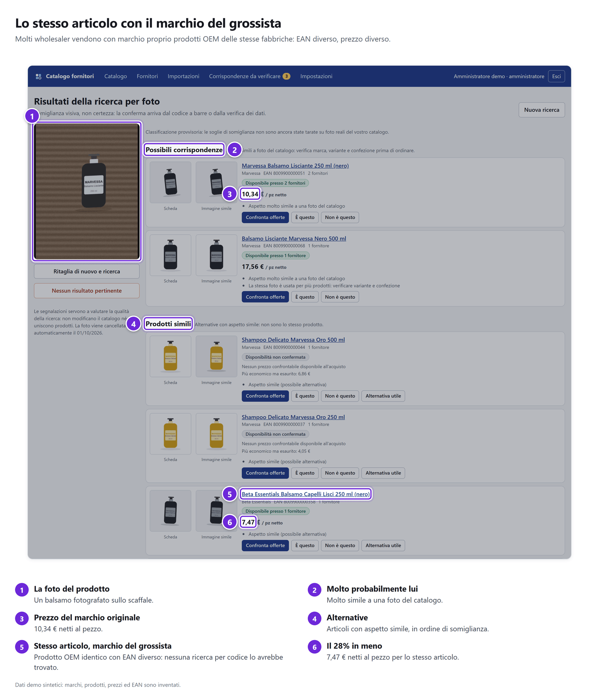
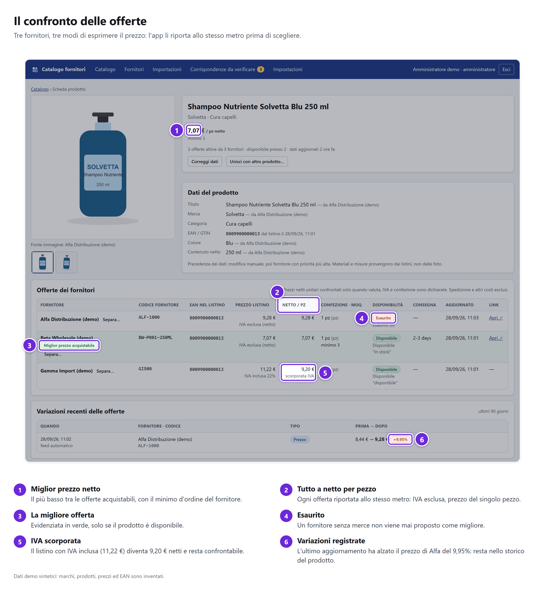
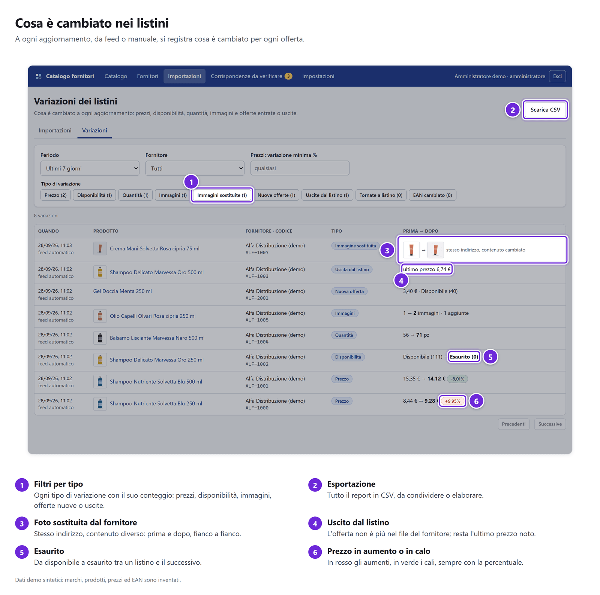
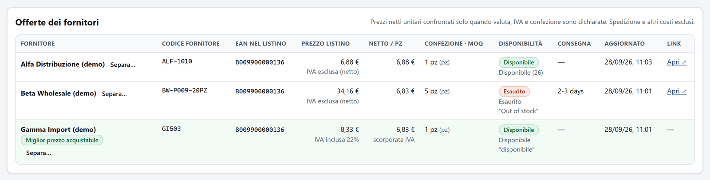
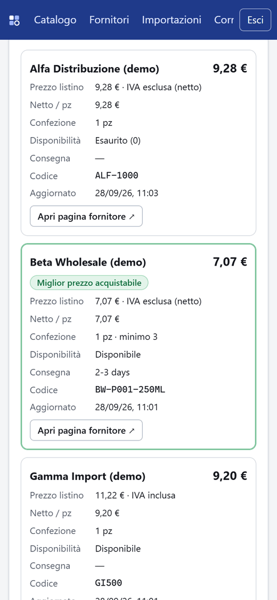
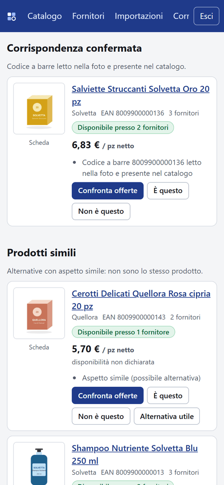

# Products Comparator

**Uno strumento per l'ufficio acquisti che ho ideato e che uso nel mio lavoro. Riunisce i listini di tutti i fornitori in un unico catalogo e indica per ogni articolo il fornitore più conveniente. Da una foto trova lo stesso prodotto, anche quando è venduto con un altro marchio.**

## Il risultato

- **Tempo.** Aggiornare e confrontare i listini richiedeva 30 minuti per fornitore ogni 10 giorni, circa 5 ore e 15 a settimana. Ora basta **circa un'ora a settimana**: −81%, circa **220 ore l'anno** liberate.
- **Costi.** Il **risparmio medio sugli acquisti è del 23%**. Viene dallo scegliere per ogni articolo il fornitore più conveniente e dal confrontare i marchi dei wholesaler, che per lo stesso articolo possono costare il 30-40% in più.
- **Perimetro.** Circa **30.000 referenze** di **15 fornitori**.

Sono numeri del mio uso reale, non misurati dall'app. Li ho ottenuti in circa 3 anni con una prima versione fatta di script e fogli di calcolo. Questo repository ne è la riscrittura completa come web app (V1, 2026), con utenti e ruoli, aggiornamenti automatici dai fornitori e ricerca per foto anche da smartphone.

**Il mio ruolo.** Ho ideato lo strumento partendo dal mio processo di acquisto, ne ho definito le esigenze e l'ho verificato sul campo. Per scrivere il codice mi sono avvalso di Claude (Anthropic) come assistente di sviluppo.

## Il problema

Le aziende con un catalogo molto ampio, multibrand e multicategoria, si riforniscono da molti fornitori, ognuno con il proprio listino, i propri codici e il proprio formato. Questa frammentazione costa tempo, soldi ed errori.

- **Nessuna visione d'insieme.** I prodotti di ogni fornitore stanno in file e portali separati: per sapere chi ha un articolo, a che prezzo e con quale disponibilità bisogna aprirli uno per uno.
- **Lo stesso prodotto può costare anche il 20% in più.** Nello stesso periodo, alle stesse condizioni di porto franco e con gli stessi tempi di consegna, un articolo può costare anche il 20% in più da un fornitore, mentre un altro costa il 20% in meno da un altro. Su ordini da migliaia di euro lo spreco è importante. Il confronto a mano è lento e porta a errori: un prezzo IVA inclusa sembra più alto di uno netto, una confezione da 6 sembra più cara del pezzo singolo.
- **Lo stesso articolo con marchi diversi.** Con l'abbassamento delle barriere commerciali molti wholesaler vendono marchi propri che sono prodotti OEM delle stesse fabbriche, spesso cinesi. L'oggetto è lo stesso, ma marchio ed EAN cambiano: nessuna ricerca per codice li mette uno accanto all'altro, e l'alternativa più conveniente resta invisibile, anche quando un marchio costa il 30-40% in più di un altro.
- **I listini cambiano di continuo.** Prezzi e giacenze si aggiornano ogni giorno, in formati diversi (CSV, Excel, colonne con nomi diversi), e le variazioni passano inosservate.
- **Spesso si ha in mano il prodotto, non il suo codice.** In magazzino, o davanti a un campione, manca il codice con cui ciascun fornitore lo identifica nel proprio listino.

## Come lo risolve

- **Una dashboard centralizzata.** I listini di tutti i fornitori, caricati a mano o scaricati ogni giorno da un feed, confluiscono in un unico catalogo normalizzato, filtrabile per fornitore, marca, categoria, prezzo e disponibilità. Le offerte con lo stesso EAN valido finiscono nella stessa scheda prodotto, restando distinte per fornitore.
- **Il fornitore più conveniente a colpo d'occhio.** Il confronto usa il prezzo netto per pezzo, IVA esclusa, nella stessa valuta. Le offerte non confrontabili vengono segnalate invece di essere mescolate, e un prezzo più basso ma esaurito è mostrato a parte. La scheda affianca tutte le offerte con confezione, MOQ, scaglioni, stock, tempi di consegna e link al fornitore.
- **Dalla foto a tutti i marchi dello stesso articolo.** Da una foto, scattata o caricata, la ricerca visiva trova il prodotto e gli affianca gli articoli simili venduti da altri wholesaler con i propri marchi, ciascuno con il miglior prezzo confrontabile e il numero di fornitori che lo hanno disponibile. Legge anche il codice a barre quando è visibile. Per confrontare un'intera tipologia, il catalogo si filtra per categoria e si ordina per prezzo.
- **Variazioni sotto controllo.** A ogni aggiornamento dei listini si registra cosa è cambiato: prezzi (con la %), disponibilità, quantità, immagini, prodotti nuovi o usciti.

Esempio: un operatore fotografa un flacone in magazzino. L'app riconosce il prodotto, mostra quali fornitori lo vendono e a che prezzo netto per pezzo, e gli affianca gli articoli simili venduti con altri marchi, ciascuno con il suo prezzo migliore. La somiglianza visiva indica un candidato, non una certezza: che due articoli siano davvero lo stesso prodotto OEM lo conferma l'operatore, guardando scheda e formato (per esempio 50 o 100 ml; il prezzo è confrontato per pezzo, non per unità di misura).

## Come ho impostato il lavoro

Le scelte che contano, al di là del codice:

1. **Partire dal processo e dai numeri.** Il punto di partenza sono due costi concreti. Il primo è il tempo: 30 minuti per fornitore ogni 10 giorni. Il secondo è il denaro: lo stesso articolo può costare fino al 20% in più da un fornitore all'altro, e un marchio OEM fino al 30-40% in più di un altro.
2. **Provare in piccolo, poi investire.** Per circa 3 anni lo strumento è stato un insieme di script e fogli di calcolo, che hanno prodotto i risultati qui sopra. Questa web app ne è la riscrittura.
3. **Standardizzare prima di confrontare.** Il listino di ogni fornitore si mappa una volta sola, poi ogni prezzo viene riportato alla stessa unità: netto per pezzo, IVA esclusa, stessa valuta. Se un confronto non è possibile, lo strumento lo segnala invece di indovinare.
4. **Automatizzare il ripetitivo, lasciare le decisioni alle persone.** Download e import dei listini sono automatici. I casi dubbi vanno in revisione a una persona: due prodotti con lo stesso EAN ma marche diverse, o due articoli che si somigliano in foto. Ogni unione è tracciata e reversibile.
5. **Rendere visibili le eccezioni.** A ogni aggiornamento un report dice cosa è cambiato: prezzi con la percentuale, esauriti, quantità, immagini, prodotti nuovi o usciti.
6. **Proteggere i dati e i costi.** Listini e prezzi restano privati e le credenziali dei fornitori sono cifrate. I permessi sono controllati sul server. La ricerca per foto gira in locale: le foto non escono dall'azienda e le ricerche non si pagano a consumo.
7. **Dichiarare i limiti.** Lo stato riportato più sotto dice cosa è verificato e cosa manca prima della produzione.

## Come funziona

Immagini composte con schermate reali dell'app, in esecuzione con i dati demo: marchi, prodotti, prezzi ed EAN sono **inventati**.





## Screenshot annotati

I numeri indicano cosa guardare; la spiegazione è sotto ogni schermata.











**Formati diversi, stesso netto per pezzo.** Un listino netto, una confezione da 5 a 34,16 € e un prezzo IVA inclusa a 8,33 € vengono riportati a 6,88 €, 6,83 € e 6,83 € al pezzo prima di scegliere.



**Su smartphone**: le offerte come schede, con la migliore evidenziata, e i risultati della ricerca per foto.

<p>
  
  
</p>

> **Stato** (aggiornato al 2026-09-28): V1 funzionante in locale, con feed automatici e report delle variazioni, verificata con test automatici, un test end-to-end e benchmark **su dati sintetici**. **Non è production-ready**: mancano la calibrazione della ricerca visiva su foto reali, una prova di deploy e una prova di ripristino. Dettagli in [docs/PROGRESS.md](docs/PROGRESS.md).

## Cosa fa

- **Catalogo** a griglia con card (immagine, marca, EAN, numero di fornitori, miglior prezzo netto confrontabile, "disponibile presso N fornitori", dati non aggiornati); filtri per fornitore, marca, categoria, prezzo, disponibilità, EAN, immagini; paginazione lato server.
- **Ricerca per foto**: trascina, incolla, scegli un file o scatta; ritaglio facoltativo; risultati in tre gruppi (confermati da barcode, possibili, simili) con l'immagine che ha generato il match, astensione quando nessun risultato è affidabile, nuovo ritaglio, feedback.
- **Ricerca testuale, EAN e SKU** (tollera i refusi; UPC-A ed EAN-13 equivalenti); **lettura barcode** live (BarcodeDetector o zxing-wasm locale) e inserimento manuale sempre disponibile.
- **Scheda prodotto**: galleria, dati canonici con fornitore di provenienza, EAN e loro origine, offerte in tabella (su mobile come schede) con prezzo di listino, trattamento IVA, netto per pezzo, confezione, MOQ, scaglioni, stock, tempi, aggiornamento e link.
- **Feed automatici**: per ogni fornitore si può impostare l'indirizzo del listino (CSV/XLSX, anche con utente/password o token, salvati cifrati) da scaricare **una volta al giorno** a un orario scelto (o ogni N ore); il file viene importato con la mappatura salvata.
- **Report delle variazioni**: a ogni aggiornamento (feed o manuale) si registra cosa è cambiato: **prezzi** (con %), **disponibilità e quantità**, **immagini** aggiunte, tolte o sostituite dal fornitore allo stesso indirizzo (con miniature prima/dopo), offerte nuove, uscite o tornate a listino, EAN corretti. Si consulta in Importazioni › Variazioni (filtri, CSV), nel dettaglio import e nella scheda prodotto.
- **Fornitori e import CSV/XLSX**: wizard con lettura, mappatura salvabile, anteprima validata, snapshot/delta, stato e avanzamento, errori per riga (anche in CSV), ripresa dal checkpoint, immagini scaricate e indicizzate in background.
- **Corrispondenze da verificare**: conflitti EAN e possibili doppioni; unione, separazione, override e relativo annullamento, tutto tracciato.
- **Ruoli** amministratore e operatore, applicati lato server su ogni risorsa.

## Stack

TypeScript su Node 24 (senza transpiler: type stripping nativo) · Fastify 5 · React 19 + Vite 8 · PostgreSQL 18 + pgvector 0.8 (HNSW) + FTS/trigram · coda graphile-worker su Postgres · storage S3-compatibile (SeaweedFS in locale) · encoder visivo **SigLIP 2** ONNX locale (Transformers.js / onnxruntime-node, CPU). Motivazioni in [docs/DECISIONS.md](docs/DECISIONS.md).

## Avvio locale

Prerequisiti: Node ≥ 24, pnpm 11. Poi **una** delle due opzioni per PostgreSQL + S3.

**A) Docker (ambiente di riferimento, non eseguito su questa macchina: vedi PROGRESS):**
```bash
cp .env.example .env
docker compose up -d --build
docker compose exec api node src/scripts/create-user.ts --email tu@azienda.it --name "Nome Cognome" --role admin
```
App su http://localhost:3000.

**B) Senza Docker, con WSL Ubuntu (percorso usato e verificato durante lo sviluppo su Windows):**
```bash
pnpm install
wsl -d Ubuntu -- bash scripts/dev/setup-wsl-postgres.sh
wsl -d Ubuntu -- bash scripts/dev/wsl-seaweedfs.sh start
cp .env.example .env
pnpm migrate
pnpm build
pnpm user:create -- --email tu@azienda.it --name "Nome Cognome" --role admin
```
Poi, in due terminali:
```bash
pnpm start
pnpm worker
```
App su http://127.0.0.1:3000.

In sviluppo, al posto dei due terminali: `pnpm dev` avvia API (riavvio automatico alle modifiche), worker e frontend con hot reload su http://127.0.0.1:5173 (proxy `/api` verso 3000). Ctrl+C ferma tutto; se uno dei tre processi si chiude, vengono fermati anche gli altri. Il worker non si riavvia da solo: dopo modifiche ai job, rilanciare `pnpm dev`.

Al primo avvio i pesi del modello (~372 MB, revisione fissata) vengono scaricati in `.models/`. Per scaricarli in anticipo: `node --env-file=.env src/scripts/model-download.ts`.

### Demo con dati sintetici

```bash
pnpm demo:fixtures
pnpm demo:seed
pnpm demo:images
pnpm worker
```
`demo:fixtures` genera un catalogo neutro multi-marca e multi-categoria (cura della persona, igiene, piccoli elettrodomestici), 3 listini in formati diversi (CSV cp1252 con `;`, XLSX in inglese, CSV con IVA inclusa) con prezzi che differiscono tra fornitori, 3 articoli venduti anche con il marchio del grossista (gemelli OEM, EAN diverso), le immagini e 19 foto di prova in `fixtures/demo/`. `demo:seed` crea fornitori, categorie, utenti `admin@demo.local` e `operatore@demo.local` (password da `DEMO_ADMIN_PASSWORD` / `DEMO_OPERATOR_PASSWORD`, altrimenti generate e stampate una sola volta) ed esegue gli import. `demo:images` serve le immagini (e il listino demo del "giorno 2" in `/feeds/`) su 127.0.0.1:4010, ammesso solo in sviluppo tramite `IMAGE_FETCH_DEV_ALLOW`. Marche, prodotti ed EAN demo sono **fittizi**.

Per provare il feed e il report delle variazioni: nella pagina del fornitore *Alfa Distribuzione (demo)* impostare l'indirizzo `http://127.0.0.1:4010/feeds/alfa-listino-giorno2.csv`, salvare e premere **Aggiorna ora**. Il listino del giorno 2 ha prezzi cambiati, un prodotto esaurito, una quantità diversa, un'immagine in più, un prodotto uscito e uno nuovo. Richiede `SECRETS_KEY` nel `.env`.

## Test e benchmark

| Comando | Cosa verifica | Esito al 2026-09-28 |
|---|---|---|
| `pnpm typecheck` | TypeScript server + web | pulito |
| `pnpm test:unit` | GTIN, prezzi, stock, parser, SSRF, barcode, template, pianificazione feed, cifratura, variazioni, protezione XLSX | 69/69 |
| `pnpm test` | unit + integrazione su Postgres reale (`TEST_DATABASE_URL`, **viene svuotato**), feed, ricontrollo immagini e XLSX rifiutati inclusi | 117/117 |
| `pnpm test:e2e` | flusso completo con HTTP, S3, download e modello reali | 6/6 |
| `pnpm bench:visual -- --set fixtures/demo/queries.json [--crop]` | Recall@1/@5, falsi match, astensione, soglie suggerite | sintetico, SigLIP 2: R@5 92,9% a foto intera, 100% con ritaglio (CLIP B/32 sul set precedente: 78,6% / 100%) |
| `pnpm bench:load -- --products 60000 --users 5` | latenza API e ricerca foto su 60.000 vettori (DB `comparator_bench` separato) | API p95 150 ms; foto p95 4,8 s lato server con 5 utenti |

Risultati, hardware e limiti: [docs/BENCHMARK.md](docs/BENCHMARK.md).

## Documentazione

| Documento | Contenuto |
|---|---|
| [docs/ARCHITECTURE.md](docs/ARCHITECTURE.md) | Componenti, flussi, scelte trasversali |
| [docs/DATA_MODEL.md](docs/DATA_MODEL.md) | ERD, vincoli, invarianti, storage |
| [docs/IDENTITY.md](docs/IDENTITY.md) | Normalizzazione GTIN, accorpamento, conflitti, reversibilità |
| [docs/IMPORTS.md](docs/IMPORTS.md) | Import CSV/XLSX, upsert, snapshot, ripresa, connettori, dati richiesti ai fornitori |
| [docs/VISUAL_SEARCH.md](docs/VISUAL_SEARCH.md) | Modello e licenza, pipeline, soglie, cambio modello, requisiti e tempi |
| [docs/BENCHMARK.md](docs/BENCHMARK.md) | Risultati e protocollo per il benchmark reale |
| [docs/OPERATIONS.md](docs/OPERATIONS.md) | Deploy, backup/ripristino, monitoraggio, sicurezza, costi stimati |
| [docs/DECISIONS.md](docs/DECISIONS.md) · [docs/PROGRESS.md](docs/PROGRESS.md) | Registro decisioni e stato di avanzamento |
| `templates/listino-template.csv` / `.xlsx` | Modello di listino riconosciuto automaticamente dal wizard |

## Configurazione

Tutte le variabili sono in [.env.example](.env.example), validate all'avvio (`src/config.ts`). Nessun segreto nel repository; in produzione vanno in `deploy/.env.production` (vedi `deploy/.env.production.example`).
