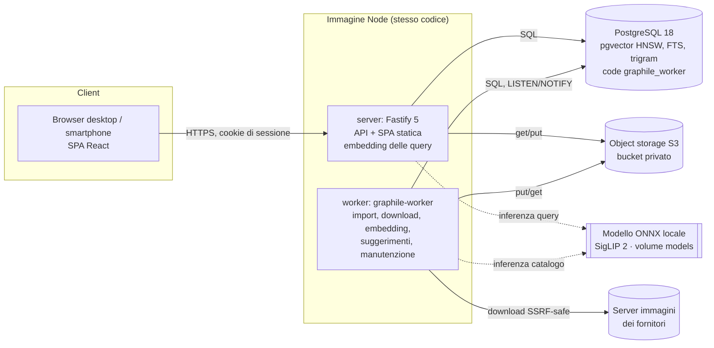

# Architettura

Monolite modulare TypeScript (Node 24) con due processi e servizi di supporto containerizzati. Le decisioni motivate sono in [DECISIONS.md](DECISIONS.md).

## Moduli (src/)

| Cartella | Responsabilità |
|---|---|
| `config.ts` | Configurazione da variabili d'ambiente, validata con zod (vedi `.env.example`) |
| `db/` | Pool pg, transazioni con retry su deadlock/serializzazione, migrazioni |
| `lib/` | Funzioni pure: GTIN, decimali esatti, parsing delle celle, testo, hash |
| `domain/` | Regole di dominio: prezzi/stock, identità, dati canonici, associazioni reversibili, suggerimenti, audit |
| `imports/` | Lettura CSV/XLSX, mappatura, normalizzazione, applicazione a batch, ciclo di vita dei run, interfaccia connettori |
| `images/` | Download SSRF-safe, deduplica e derivate, task di embedding |
| `vision/` | Registro modelli, preprocessing condiviso, embedder ONNX, indice vettoriale, lettura barcode |
| `search/` | Catalogo (griglia, testo, EAN, SKU, filtri, scheda), ricerca per foto |
| `server/` | App Fastify, autenticazione e ruoli, route, metriche |
| `worker/` | Task e avvio del worker |
| `scripts/` | CLI: migrazioni, utenti, modello, demo, benchmark |
| `web/` | SPA React 19 + Vite 8 (React Router 8, TanStack Query), servita dall'API in produzione |

## Flussi principali

**Ricerca per foto**: browser (orientamento EXIF, riduzione a 2048 px, eventuale conversione HEIC→JPEG) → `POST /api/search/photo` (multipart, ritaglio facoltativo) → validazione, preprocessing `pp1`, lettura barcode → embedding (modello attivo, nel processo API) → HNSW top-200 → aggregazione per prodotto → filtri → gruppi confermato/possibile/simile oppure astensione → `photo_searches` → pagina risultati → scheda prodotto.

**Import**: wizard (upload → lettura → mappatura → anteprima) → `startRun` accoda `import_run` **nella stessa transazione** → worker: staging → batch con checkpoint → finalizzazione → job `image_fetch` (per host) → `image_embed` (per shard) → `products_refresh`/`suggest_matches`.

## Scelte trasversali

- **Transazioni come confine di coerenza.** Dati e job accodati insieme (`graphile_worker.add_job` in SQL), riepiloghi di prodotto ricalcolati nella stessa transazione della modifica, checkpoint dell'import salvato insieme al batch.
- **Idempotenza.** `job_key` per deduplicare i job; upsert con chiavi naturali (`supplier_sku`, `url`, `sha256`, `(asset, modello)`); i task controllano lo stato prima di agire (un embedding già `done` non viene ricalcolato).
- **Degrado controllato.** Se il modello non è disponibile, la ricerca per foto risponde `provider_unavailable` e il resto funziona. Se lo storage non risponde, `/readyz` fallisce. Un import fallito lascia i dati precedenti e li marca come non aggiornati.
- **Sicurezza.** Autorizzazione server-side per ogni route (ruoli `admin`/`operator`); guardia CSRF (header custom più controllo dell'Origin) con cookie `SameSite=Lax`, `HttpOnly` e `Secure` in produzione; CSP restrittiva; bucket privato con immagini servite dall'API dopo controllo di sessione; downloader SSRF-safe; input CSV/XLSX trattati come dati; limiti su upload, pixel e tempi; rate limit per utente su login, upload e ricerca foto; log strutturati senza cookie né segreti.
- **Estensioni previste, non implementate.** Connettori API/feed (interfaccia pronta), reranking multimodale o rimozione dello sfondo (solo se un benchmark ne dimostra l'utilità), OCR, promozione delle foto di ricerca a benchmark con consenso, signed URL S3/CDN se il traffico immagini cresce, multi-organizzazione (fuori ambito).
