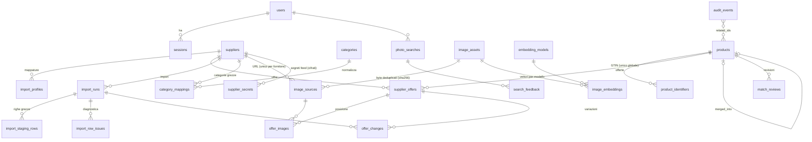

# Modello dati

Schema: `migrations/0001_init.sql` più le migrazioni successive (`0002_feeds_changes.sql`, `0003_image_recheck.sql`). Migrazioni forward-only, applicate da `src/db/migrate.ts` con advisory lock e checksum. La modifica di una migrazione già applicata viene rifiutata.

## Entità

| Tabella | Responsabilità | Vincoli principali |
|---|---|---|
| `users`, `sessions` | Utenti con ruolo `admin`/`operator`; sessioni opache (in DB solo lo SHA-256 del token) | email `citext UNIQUE`; cascade sulle sessioni |
| `suppliers` | Fornitore, priorità dei dati canonici, IVA/valuta di default, host immagini autorizzati, soglia di obsolescenza, connettore/feed (configurazione senza segreti), pianificazione e stato del feed, stato dell'ultimo import | `code UNIQUE`, formato del codice; indice parziale sui feed in scadenza |
| `import_profiles` | Mappatura colonne e opzioni di lettura salvate per fornitore | `UNIQUE(supplier_id, name)` |
| `categories`, `category_mappings` | Categorie normalizzate e mappatura delle categorie grezze del fornitore | PK `(supplier_id, raw_category)` |
| `products` | Identità canonica, valori canonici calcolati, override manuali, riepilogo per la griglia (prezzo migliore, conteggi), testo di ricerca | `status` ∈ active/merged/archived; `merged ⇔ merged_into_id`; GIN su `search_tsv` e trigram |
| `product_identifiers` | GTIN-14 canonici del prodotto (anche più di uno, dopo un'unione motivata) | **`UNIQUE(kind, value)`**: un GTIN appartiene a un solo prodotto |
| `supplier_offers` | Riga del listino: SKU, barcode originale e stato, dati commerciali, stock, lead time, link, `source_row` originale, `row_hash`, `source_as_of` | **`UNIQUE(supplier_id, supplier_sku)`**; `(valid/restricted) ⇔ gtin NOT NULL`; `price ≥ 0`; `stock_quantity ≥ 0` o NULL (sconosciuto) |
| `image_sources` | URL di immagine per fornitore, stato del download, tentativi, errore, validatori HTTP (ETag, Last-Modified) e data dell'ultimo ricontrollo | `UNIQUE(supplier_id, url)`; `fetched ⇔ image_asset_id` |
| `offer_images` | Associazione offerta ↔ immagine con posizione (provenienza) | PK `(offer_id, image_source_id)` |
| `image_assets` | Asset fisico: sha256, dHash, dimensioni, chiavi storage delle derivate | `sha256 UNIQUE` (dedupe byte-identici) |
| `embedding_models` | Modelli registrati, stato (building/active/retired), soglie | **un solo `active`** (indice unico parziale) |
| `image_embeddings` | Vettore per (asset, modello), stato, errori | PK `(image_asset_id, model_key)`; `done ⇒ embedding NOT NULL`; HNSW parziale per modello |
| `import_runs` | Run di import: file (hash, chiave storage), mappatura, modalità, `as_of`, contatori, checkpoint, heartbeat, esito snapshot | **un solo `queued/running` per fornitore** (indice unico parziale) |
| `import_staging_rows` | Righe grezze del file per ripresa e diagnostica | PK `(run, row_number)` |
| `import_row_issues` | Errori e avvisi di riga (campo, codice, messaggio, valore) | dedupe per ripresa idempotente |
| `match_reviews` | Revisioni: conflitto GTIN, possibile doppione, GTIN cambiato | **una sola revisione aperta per coppia e tipo** |
| `product_distinct_pairs` | Decisioni persistenti "prodotti diversi" | PK ordinata `(a < b)` |
| `audit_events` | Traccia append-only con dati per l'annullamento (`reverts_event_id` / `reverted_by_event_id`) | GIN su `related_ids` |
| `photo_searches`, `search_feedback` | Ricerche per foto (immagine a scadenza), risultati, tempi, feedback | indice sulle scadenze |
| `app_settings` | Impostazioni applicative chiave/valore | — |
| `supplier_secrets` | URL e credenziali dei feed, cifrati (AES-256-GCM, AAD `fornitore:nome`) | PK `(supplier_id, name)`; mai esposti dall'API |
| `offer_changes` | Variazioni per offerta a ogni import: prezzo (% se confrontabile), disponibilità, quantità, immagini (URL cambiati o contenuto sostituito allo stesso URL), nuove/uscite/rientrate, EAN | `UNIQUE(import_run_id, offer_id, change_type)`; conservazione `CHANGE_HISTORY_DAYS` |

Le code di lavoro vivono nello schema `graphile_worker`, gestito dalla libreria.

## Invarianti garantite dal database (anche con concorrenza)

- Un GTIN canonico appartiene a un solo prodotto (`product_identifiers UNIQUE`); in più, advisory lock per GTIN negli import.
- Uno SKU è unico per fornitore.
- Al massimo un import attivo per fornitore.
- Un solo modello di embedding attivo.
- Una sola revisione aperta per coppia di prodotti e tipo.
- Coerenza tra stato del barcode e GTIN, tra stato `merged` e `merged_into_id`, tra download riuscito e asset.

## Valori monetari e stock

`numeric(14,4)` per i prezzi (mai float), in JS BigInt in scala 10⁶ (`src/lib/decimal.ts`). Valuta ISO-4217 per offerta; trattamento IVA `net|gross|unknown` più l'aliquota; `units_per_pack` (pezzi coperti dal prezzo); `moq`; `price_tiers` in JSON. Stock: `NULL` = sconosciuto, `0` = esaurito, più lo stato qualitativo e il testo originale.

## Storage (oggetti)

| Chiave | Contenuto | Politica |
|---|---|---|
| `img/<sha[0:2]>/<sha>/thumb.webp` | miniatura 400 px per la griglia | immutabile, cache 7 giorni lato browser |
| `img/…/display.webp` | 1200 px per la scheda (copia controllata: non si dipende dall'URL del fornitore) | immutabile |
| `img/…/infer.jpg` | 448 px su bianco per l'inferenza (`pp1`) | immutabile; serve alla reindicizzazione |
| `img/…/original.<ext>` | originale | solo con `IMAGE_KEEP_ORIGINALS=true` (default no: l'URL sorgente resta registrato) |
| `imports/<run>/<sha>` | file caricato | conservato per tracciabilità |
| `searches/<id>.jpg` | foto di ricerca (senza EXIF) | cancellata dopo 72 h |

Gli oggetti orfani sotto `img/` (derivate senza riga `image_assets`, più vecchie di 24 h) vengono rimossi dal job `maintenance`.
